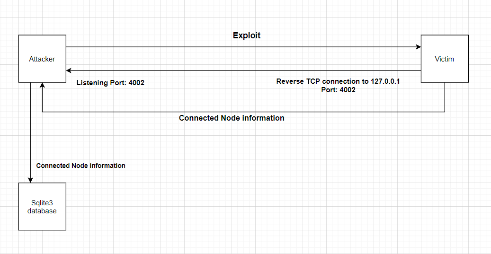
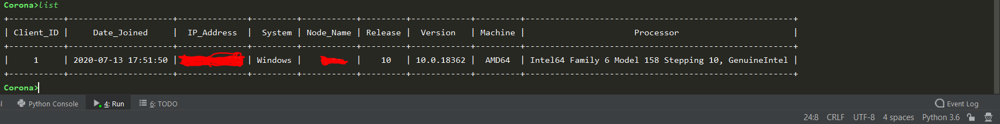
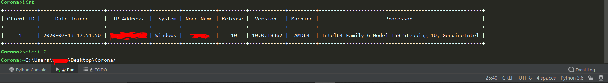

# Corona Reverse Shell

Python Reverse shell

## Simple multiclient python reverse shell with extra functionalities

Firstly run the server program using any available python IDE and ensure the interpreter is running python 3. 
Wait for a few seconds allowing the listener to actively listen for new connection before running the client program

## Accessing active connection list 

Simply run the 'list' command to display all active connection to the server in a tabular fashion. 

## Starting a session 

To start a session with a connected node simply use the "select" statement followed by the client ID of the connected node

## Screenshot & Camshot 

When taking a screenshot or camshot from the victim's machine the image is stored on the server in the following format: \
Screenshot: (victim_ip)_screenshot_img_imageId.extention(jpg) \
Camshot: (victim_ip)_camshot_img_imageId.extention(jpg) \
image ID will auto increment for every image captured

## Features 
 ####  Corona Shell Commands 
&nbsp;&nbsp;&nbsp;&nbsp;               'list':['lists all active connections'] \
&nbsp;&nbsp;&nbsp;&nbsp;               'select (target Client_ID)':['selects a target and creates a session between the server and the client machine '] \
&nbsp;&nbsp;&nbsp;&nbsp;               'guide': Display Corona's user commands. 
 ####  Client Commands 
&nbsp;&nbsp;&nbsp;&nbsp;              'quit':['takes you back to the Corona shell interface'] \
&nbsp;&nbsp;&nbsp;&nbsp;              'wifi_passwords':['gets all known wifi password that the client node has ever connected to'], \
 &nbsp;&nbsp;&nbsp;&nbsp;             'screenshot':['takes a screen shot of the client machine'], \
 &nbsp;&nbsp;&nbsp;&nbsp;             'camshot':['captures an image from the client's webcam'], \
 &nbsp;&nbsp;&nbsp;             'encrypt (password) (directory)':[encrypts all files in the directory specified'] [if directory is not specified all files in the current directory will be encrypted], \
&nbsp;&nbsp;&nbsp;              'decrypt (password) (directory)':['decrypts all files in the directory specified'] [if directory is not specified all files in the current directory will be decrypted], \
&nbsp;&nbsp;&nbsp;&nbsp;              'get (filename or path)':['gets file from the victim's machine and sends it over to the server'], \
&nbsp;&nbsp;&nbsp;&nbsp;              'send (filename or path)':['send file from server and stores it on the victim's machine'] 

## Author

* **Xand**
